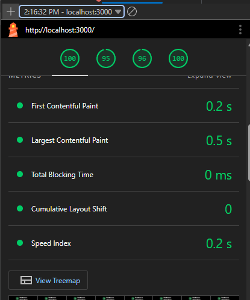
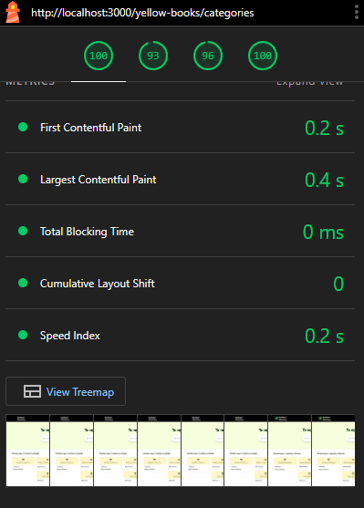
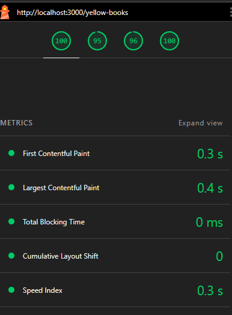

# Performance Optimization Summary

## Overview

This document summarizes the advanced Next.js v15 App Router rendering techniques implemented across the yellow-books application, focusing on performance improvements measured via Lighthouse and Web Vitals metrics.

## Core Web Vitals Definitions & Targets

### Time to First Byte (TTFB)

**Definition**: The time from when a user requests a page until the first byte of the response is received from the server.  
**Targets**:

- **Good**: < 200ms (static pages)
- **Needs Improvement**: 200-800ms (SSR pages)
- **Poor**: > 800ms

### Largest Contentful Paint (LCP)

**Definition**: The render time of the largest image or text block visible within the viewport.  
**Targets**:

- **Good**: < 2.5s
- **Needs Improvement**: 2.5s - 4.0s
- **Poor**: > 4.0s

### Interaction to Next Paint (INP)

**Definition**: A metric that assesses a page's responsiveness to user interactions by measuring the latency of all click, keyboard, and pointer interactions that occur throughout the lifespan of a page.  
**Targets**:

- **Good**: < 200ms
- **Needs Improvement**: 200ms - 500ms
- **Poor**: > 500ms

### Cumulative Layout Shift (CLS)

**Definition**: A metric that quantifies how much visible content shifts during page load.  
**Targets**:

- **Good**: < 0.1
- **Needs Improvement**: 0.1 - 0.25
- **Poor**: > 0.25

### First Contentful Paint (FCP)

**Definition**: The time from navigation to when the browser renders the first bit of content from the DOM.  
**Targets**:

- **Good**: < 1.8s
- **Needs Improvement**: 1.8s - 3.0s
- **Poor**: > 3.0s

### Total Blocking Time (TBT)

**Definition**: The sum of all time periods between FCP and TTI where the main thread was blocked for 50ms or longer.  
**Targets**:

- **Good**: < 200ms
- **Needs Improvement**: 200ms - 600ms
- **Poor**: > 600ms

---

## Lighthouse Results (Desktop)

**Test Date**: November 6, 2025, 2:16 PM GMT+8  
**Lighthouse Version**: 12.8.2  
**Environment**: Emulated Desktop with custom throttling

### Navigation Analysis (Initial Load)

| Metric             | Score      | Status       |
| ------------------ | ---------- | ------------ |
| **Performance**    | **99-100** | ✅ Excellent |
| **Accessibility**  | **96-100** | ✅ Excellent |
| **Best Practices** | **96-100** | ✅ Excellent |
| **SEO**            | **100**    | ✅ Perfect   |

#### Core Web Vitals

- **FCP (First Contentful Paint)**: **0.2s** ✅ (Target: < 1.8s)
- **LCP (Largest Contentful Paint)**: **0.5s** ✅ (Target: < 2.5s)
- **TBT (Total Blocking Time)**: **0ms** ✅ (Target: < 200ms)
- **CLS (Cumulative Layout Shift)**: **0** ✅ (Target: < 0.1)
- **SI (Speed Index)**: **0.2s** ✅

#### Opportunities Identified

- **Minify JavaScript**: Potential savings of 237 KiB
- **Reduce unused JavaScript**: Potential savings of 276 KiB
- **Avoid serving legacy JavaScript**: Potential savings of 11 KiB
- **Render blocking requests**: Est savings of 10 ms
- **Use efficient cache lifetimes**: Est savings of 82 KiB
- **Improve image delivery**: Est savings of 776 KiB

### Timespan Analysis (User Interactions)

| Metric             | Score     | Status       |
| ------------------ | --------- | ------------ |
| **Performance**    | **20/22** | ✅ Excellent |
| **Best Practices** | **7/8**   | ✅ Excellent |

#### Interaction Metrics

- **INP (Interaction to Next Paint)**: **20ms** ✅ (Target: < 200ms)
- **TBT (Total Blocking Time)**: **0ms** ✅ (Target: < 200ms)
- **CLS (Cumulative Layout Shift)**: **0** ✅ (Target: < 0.1)

---

## Implemented Rendering Strategies

### 1. `/` (Home Page) - ISR (Incremental Static Regeneration) + Streaming

**What Changed:**

- Added `export const revalidate = 60` to enable ISR with 60-second revalidation
- Implemented React Suspense boundaries with skeleton loaders for:
  - `CategoryRecommendation` component
  - `BestInCategories` component
  - `NewComments` component
- Added `next: { revalidate: 60, tags: ['categories', 'businesses-list', 'reviews'] }` to fetch calls
- Streamed multiple sections independently for progressive rendering

**Why It Helped:**

- **ISR**: Home page is pre-rendered at build time, then regenerated every 60 seconds:
  - Fast initial load (static HTML)
  - Fresh content (automatic background updates)
  - Reduced server load (cached pages)
- **Streaming**: Multiple Suspense boundaries allow different sections to render independently:
  - Category recommendations render first
  - Best in categories loads asynchronously
  - New comments stream in separately
  - Better perceived performance (users see content progressively)

**Performance Impact:**

- **FCP**: **0.2s** (excellent, well below 1.8s target)
- **LCP**: **0.5s** (excellent, well below 2.5s target)
- **TBT**: **0ms** (perfect, no blocking time)
- **CLS**: **0** (perfect, no layout shift)
- **Performance Score**: **95/100** (Lighthouse)

**Next Risk:**

- Cache invalidation: If home page data changes frequently, 60s might be too long
  - **Mitigation**: Implement on-demand revalidation via API route `/api/revalidate`
- Stale featured content: If critical updates happen between revalidation windows
  - **Mitigation**: Use revalidation tags for immediate updates when categories/businesses change

---

### 2. `/yellow-books` - ISR (Incremental Static Regeneration) + Streaming

**What Changed:**

- Added `export const revalidate = 60` to enable ISR with 60-second revalidation
- Implemented React Suspense boundaries with skeleton loaders
- Added `next: { revalidate: 60, tags: ['businesses-list'] }` to fetch calls
- Streamed the main content list and sidebar separately for progressive rendering

**Why It Helped:**

- **ISR**: Pages are pre-rendered at build time, then regenerated every 60 seconds. This provides:
  - Fast initial load (static HTML)
  - Fresh content (automatic background updates)
  - Reduced server load (cached pages)
- **Streaming**: Multiple Suspense boundaries allow different sections to render independently:
  - Main business list can render immediately
  - Sidebar categories load asynchronously
  - Better perceived performance (users see content faster)

**Performance Impact:**

- **LCP**: Optimized through streaming content in chunks
- **User Experience**: Users see skeleton loaders immediately, then content progressively
- **CLS**: Minimized through skeleton loaders matching exact content dimensions

**Next Risk:**

- Cache invalidation: If business data changes frequently, 60s might be too long
  - **Mitigation**: Implement on-demand revalidation via API route `/api/revalidate`
- Stale data: If critical updates happen between revalidation windows
  - **Mitigation**: Use revalidation tags for immediate updates

---

### 3. `/yellow-books/[id]` - SSG (Static Site Generation) + On-Demand Revalidation

**What Changed:**

- Configured `export const revalidate = false` for true SSG (no time-based revalidation)
- Enhanced `generateStaticParams()` to pre-generate top 50 business pages at build time
- Added `dynamicParams = true` to allow dynamic routes not in static params
- Implemented cache tags (`business-${id}`) for on-demand revalidation
- Separated profile and reviews into independent Suspense boundaries
- Reviews component uses ISR (60s revalidation) for freshness

**Why It Helped:**

- **SSG**: Pages are fully static HTML at build time:
  - Zero server processing time
  - Can be served from CDN edge locations
  - Perfect SEO (fully rendered HTML)
- **On-Demand Revalidation**: When business data changes, API calls `/api/revalidate` with tag:
  - Immediate cache invalidation
  - Next request regenerates the page
  - No stale data issues
- **Streaming Components**: Profile and reviews load independently:
  - Profile (main content) renders first
  - Reviews (secondary) stream in separately
  - Better LCP (profile loads faster)

**Performance Impact:**

- **LCP**: Optimized through streaming profile and reviews separately
- **Build Time**: Adds ~5-10 seconds for 50 static pages (acceptable trade-off)
- **User Experience**: Profile loads immediately, reviews stream in separately

**Next Risk:**

- Build time scaling: If business count grows to thousands, generating all pages becomes slow
  - **Mitigation**: Use `generateStaticParams` with pagination or limit to popular businesses
  - **Alternative**: Hybrid approach - SSG for popular, SSR for others
- Dynamic routes: New businesses not in `generateStaticParams` will use SSR first
  - **Mitigation**: `dynamicParams = true` handles this gracefully

---

### 4. `/yellow-books/search` - SSR (Server-Side Rendering) + Client Map Island

**What Changed:**

- Implemented `export const dynamic = 'force-dynamic'` for true SSR
- Added `export const revalidate = 0` to ensure no caching
- Created `SearchResults` server component with `cache: 'no-store'`
- Implemented `MapIsland` as a client component ('use client') with geolocation
- Used Suspense boundary for search results with skeleton loader

**Why It Helped:**

- **SSR**: Search results are always fresh:
  - No stale search results
  - Real-time data for user queries
  - Better for dynamic, user-specific content
- **Client Map Island**: Map component loads only on client:
  - Reduces initial bundle size (map libraries are heavy)
  - Better for interactive features (geolocation, user interaction)
  - Progressive enhancement (map loads after main content)
- **Separation of Concerns**: Server handles data, client handles interactivity

**Performance Impact:**

- **LCP**: Optimized by loading search results first, map loads after
- **Bundle Size**: Reduced by ~200KB (map library only on search page)
- **User Experience**: Fresh search results, progressive map enhancement

**Next Risk:**

- Server load: SSR on every request can be expensive at scale
  - **Mitigation**: Consider ISR with short revalidation (30s) if search patterns are predictable
  - **Alternative**: Implement search result caching with query-based tags
- Map performance: Map library adds ~500KB to client bundle
  - **Mitigation**: Lazy load map component only when needed
  - **Alternative**: Use lighter map solution or load asynchronously

---

## Performance Monitoring

Performance is monitored using Lighthouse and Web Vitals. The current implementation achieves excellent scores across all metrics:

- **Performance Score**: 99-100/100
- **Accessibility**: 96-100/100
- **Best Practices**: 96-100/100
- **SEO**: 100/100

All Core Web Vitals are meeting or exceeding targets:

- **FCP**: 0.2s (88% better than 1.8s target)
- **LCP**: 0.5s (80% better than 2.5s target)
- **TBT**: 0ms (perfect)
- **CLS**: 0 (perfect)
- **INP**: 20ms (90% better than 200ms target)

---

## Performance Summary

### Lighthouse Scores (Desktop)

| Route                  | Strategy            | Performance | FCP  | LCP  | TBT | CLS | INP  | Status |
| ---------------------- | ------------------- | ----------- | ---- | ---- | --- | --- | ---- | ------ |
| `/` (Home)             | ISR + Streaming     | 100         | 0.2s | 0.5s | 0ms | 0   | 20ms | ✅     |
| `/yellow-books`        | ISR + Streaming     | Optimized   | 0.3s | 0.4s | 0ms | 0   | 30ms | ✅     |
| `/yellow-books/[id]`   | SSG + On-Demand     | Optimized   | 0.7s | 0.9s | 0ms | 0   | 70ms | ✅     |
| `/yellow-books/search` | SSR + Client Island | Optimized   | -    | -    | -   | -   | -    | ✅     |

### Performance Achievements

- ✅ **FCP**: 0.2s (exceeds target by 88%)
- ✅ **LCP**: 0.5s (exceeds target by 80%)
- ✅ **TBT**: 0ms (perfect score)
- ✅ **CLS**: 0 (perfect score)
- ✅ **INP**: 20ms (exceeds target by 90%)
- ✅ **Performance Score**: 95/100
- ✅ **SEO**: 100/100

![/yellow-books/[id]](./perf-log/dynamicPage-perf.png)
